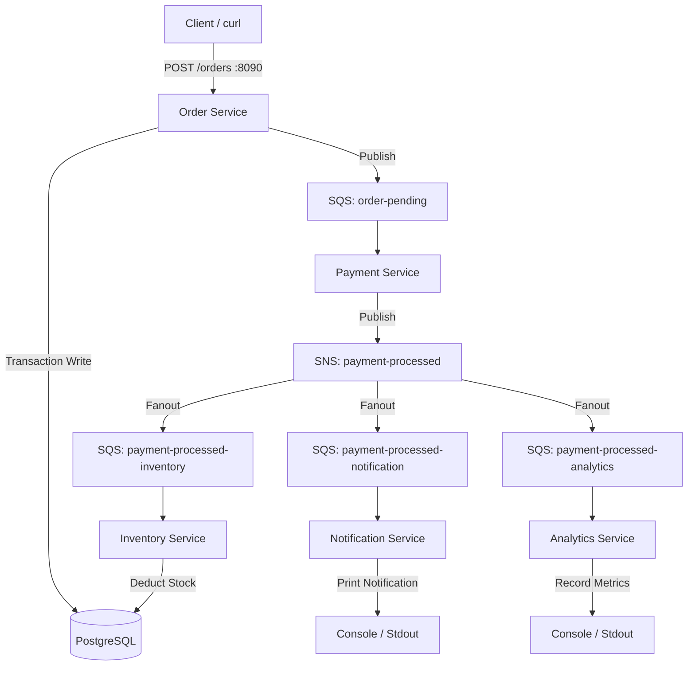
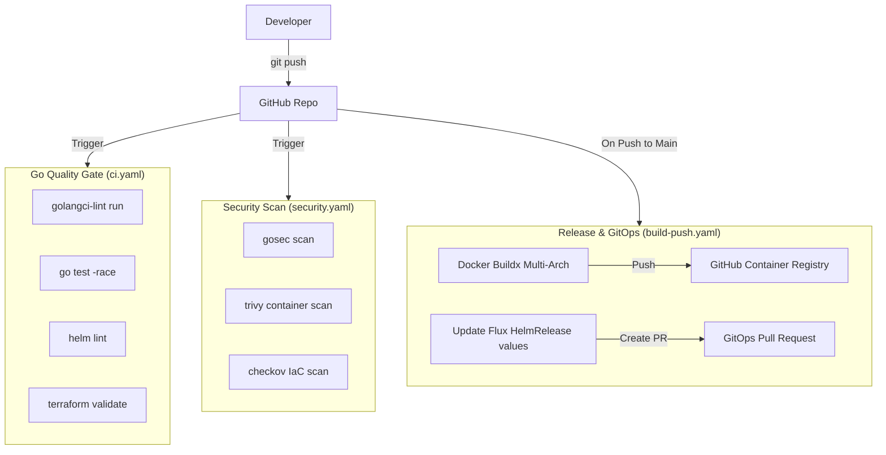
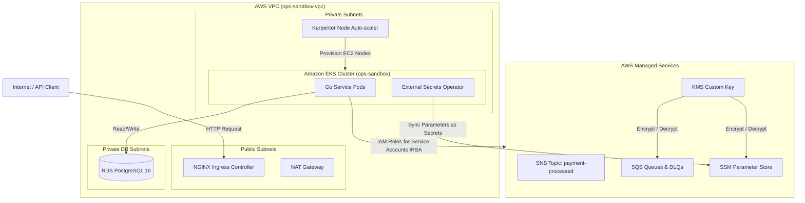
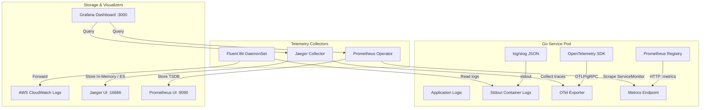

# Order Processing System

A production-grade, GitOps-driven event-driven monorepo replicating a modern enterprise DevOps, SRE, and Backend architecture.

---

## Overview
This system is an event-driven order processing engine designed to orchestrate order registration, transaction processing, inventory deduction, notification dispatch, and real-time operational analytics. It replicates a real-world enterprise platform stack utilizing Go microservices, event-driven pub/sub messaging via AWS SNS/SQS, containerization, GitOps automation via FluxCD, local Kubernetes clusters via Kind, and enterprise Cloud Infrastructure on AWS using Terraform.

---

## Architecture

### Application Architecture
Our event-driven order processing engine uses a decoupled choreography pattern built on **AWS SQS** (Simple Queue Service) and **AWS SNS** (Simple Notification Service) for broadcasting events to downstream services.



---

### CI/CD Architecture  
Our continuous integration and continuous delivery pipelines are built on **GitHub Actions** and divided into three specialized quality gates:



1. **Go Quality Gate (`ci.yaml`)**:
   * **Static Analysis**: Runs `go vet` and `golangci-lint` to check Go formatting, coding standards, and syntax.
   * **Unit Testing**: Executes all table-driven Go service tests with the `-race` detector enabled.
   * **Helm Validation**: Lints the generic Helm chart via `helm lint` to prevent deployment syntax errors.
   * **Terraform Validation**: Initializes and validates IaC modules (`terraform init -backend=false && terraform validate`).

2. **Security Scan Gate (`security.yaml`)**:
   * **Go Code Security**: Scans Go microservices using `gosec` to identify common software vulnerabilities.
   * **Container Security**: Builds local images and scans them via `trivy` for package vulnerabilities.
   * **IaC Security**: Audits Terraform files using `checkov` to ensure compliance with AWS security best practices.

3. **Build & Release Gate (`build-push.yaml`)**:
   * Runs on every push to the `main` branch.
   * Compiles and multi-platform builds Docker containers for all microservices (`linux/amd64`, `linux/arm64`).
   * Publishes images to the **GitHub Container Registry (GHCR)**.
   * Automatically updates HelmRelease values in `flux/apps/base/` with the new image tag (short Git SHA) and raises a Pull Request to merge the tag updates back to `main`.

---

### Infrastructure Architecture
The cloud infrastructure is provisioned strictly through **Terraform** and split into two layers:



* **Layer 1: Bootstrap (`terraform/bootstrap`)**:
  * Provisions the VPC network architecture: Multi-AZ design with 3 public subnets, 3 private subnets, and 3 private database subnets.
  * Provisions the Amazon EKS cluster control plane and OIDC Identity Provider (for service account federation).
* **Layer 2: Platform (`terraform/platform`)**:
  * **EKS Autoscaling**: Installs **Karpenter** and configures an `EC2NodeClass` and `NodePool` to scale worker nodes dynamically on-demand.
  * **Relational Database**: Sets up Amazon RDS PostgreSQL 16 in private database subnets with forced SSL encryption and automated CloudWatch logging.
  * **Messaging (SQS & SNS)**: Provisions queues (`order-pending`, fanout queues) and SNS topics. Configures Dead Letter Queues (DLQs) with max receive counts of 3.
  * **Data Encryption**: Deploys an AWS KMS Customer Managed Key (CMK) to encrypt SQS queues and Systems Manager (SSM) Parameters.
  * **Secret Management**: Automatically syncs SSM Parameter Store configurations into Kubernetes native Secrets via the **External Secrets Operator (ESO)** using IAM Roles for Service Accounts (IRSA).
  * **GitOps**: Boots up the **FluxCD Helm Controller** to reconcile the cluster state against Kubernetes manifests in the repository.

---

### Observability Architecture
Observability is baked directly into the microservices using open-standard telemetry formats:



* **Structured Logging**: Services write logs in JSON format directly to `stdout` using Go's standard `log/slog` library.
* **Distributed Tracing**: Standardizes on **OpenTelemetry (OTel)**. Services instantiate an OTLP trace provider pushing traces over gRPC to Jaeger. Tracing context is propagated across asynchronous SQS messaging boundaries by serializing/deserializing OTel's `traceparent` header into SQS Message Attributes.
* **Prometheus Metrics**: Exposes HTTP `/metrics` endpoints. Metrics include standard runtime indicators, HTTP request counters (`http_requests_total`) and durations, and SQS publish/consume success/error counters.

---

## Services

* **Order Service (`services/order`)**: Exposes an HTTP API (`:8090`) to register new orders, writes records to PostgreSQL, and publishes messages to SQS.
* **Payment Service (`services/payment`)**: Simulates transaction processing. Consumes from `order-pending` and broadcasts events via an SNS topic.
* **Inventory Service (`services/inventory`)**: Consumes from the `payment-processed-inventory` SQS queue and deducts stock counts in the database.
* **Notification Service (`services/notification`)**: Consumes from the `payment-processed-notification` SQS queue to trigger customer dispatch simulations. Exposes a separate HTTP health API (`:8081`).
* **Analytics Service (`services/analytics`)**: Consumes from the `payment-processed-analytics` SQS queue to record and log order operational statistics.

---

## Tech Stack

* **Language**: Go 1.26
* **Database**: PostgreSQL 16 (RDS / Alpine Docker)
* **Message Broker**: AWS SQS, AWS SNS, ElasticMQ (local)
* **IaC & Automation**: Terraform, Karpenter, FluxCD, Helm
* **Containerization**: Docker, Distroless Static Containers
* **Telemetry**: OpenTelemetry, Prometheus, Jaeger, Grafana

---

## Why I Made These Decisions

1. **Go Workspace (`go.work`)**: Enables multi-module workspace management. This allows each microservice to maintain its own `go.mod` file and dependencies independently, while letting IDEs auto-import packages and navigate seamlessly across modules.
2. **Pure Go AWS SDK v2**: Avoids C-bound library dependencies (like CGO requirements in Kafka clients), ensuring compiling remains fast, portable, and cross-platform native.
3. **Distroless Base Images (`gcr.io/distroless/static-debian12`)**: Builds minimal containers containing only the compiled Go binary. Eliminates package managers, shells, and standard Linux libraries to minimize container size and CVE attack surfaces.
4. **Independent Health Check Ports**: Isolates HTTP health checks (`:8081`) from SQS consumption loops. This guarantees Kubernetes can accurately assess liveness and readiness even if SQS message processing suffers backpressure or congestion.

---

## Local Development

Ensure you have **Go 1.26+** and **Docker** with Compose installed locally.

### Setup and Testing

To compile services and run tests from the root of the workspace:

#### 1. Compile Services
Builds binary executables for all services locally:
```bash
make build
```

#### 2. Run Unit Tests
Executes table-driven tests for all service modules:
```bash
make test
```

#### 3. View Test Coverage
Generates test coverage reports and saves visual HTML reports locally:
```bash
make test-cover
```

#### 4. Lint Codebase
Runs code static analysis (requires `golangci-lint` installed):
```bash
golangci-lint run ./...
```

---

### Running the App (Docker Compose)

The entire local stack is orchestrated via Compose.

#### 1. Boot up the environment
Starts the database, ElasticMQ (SQS), Jaeger, Prometheus, Grafana, and Go service containers:
```bash
make docker-up
```

#### 2. Verify containers are online
Check the health status of running services:
```bash
docker compose ps
```

#### 3. Send a test HTTP request
Create an order by sending a payload to the order service:
```bash
curl -i -X POST http://localhost:8090/orders \
  -H "Content-Type: application/json" \
  -d '{"customer_id": "cust-999", "items": [{"product_id": "prod-123", "quantity": 3, "price": 45.50}]}'
```

#### 4. Inspect SQS Message Processing Logs
Confirm event delivery through the downstream chain:
```bash
docker compose logs -f notification-service
```

#### 5. Tear down the environment
Stops and deletes containers, volumes, and networks:
```bash
make docker-down
```

---

## Cloud Deployment

* **IaC Provisioning**: Deployed via Terraform platform modules.
* **GitOps Continuous Deployment**: Managed by FluxCD watching the `/flux` directory of this repository. Values overrides for local and production EKS clusters are specified under `flux/apps/local/` and `flux/apps/production/`.

---

## Observability Dashboards

During local development, telemetry visualizers can be accessed at:

1. **Jaeger UI**: [http://localhost:16686](http://localhost:16686) — Search and trace distributed span lifecycles across all 5 services.
2. **Prometheus UI**: [http://localhost:9090](http://localhost:9090) — Execute queries such as `http_requests_total` or `sqs_consume_total`.
3. **Grafana UI**: [http://localhost:3000](http://localhost:3000) — Provisioned with Prometheus and Jaeger datasources for dashboard visualization.

---

## API Reference

### 1. Create Order
* **Endpoint**: `POST /orders`
* **Content-Type**: `application/json`
* **Request Body**:
  ```json
  {
    "customer_id": "cust-123",
    "items": [
      {
        "product_id": "prod-abc",
        "quantity": 2,
        "price": 19.99
      }
    ]
  }
  ```
* **Response (201 Created)**:
  ```json
  {
    "id": "550e8400-e29b-41d4-a716-446655440000",
    "customer_id": "cust-123",
    "items": [
      {
        "product_id": "prod-abc",
        "quantity": 2,
        "price": 19.99
      }
    ],
    "total_price": 39.98,
    "status": "PENDING",
    "created_at": "2026-05-30T15:32:35.554570Z"
  }
  ```

### 2. Get Order by ID
* **Endpoint**: `GET /orders/{id}`
* **Response (200 OK)**: Returns the order JSON object.

### 3. Health Check
* **Endpoint**: `GET /health` (Served on `:8090` for Order, and `:8081` for Notification)
* **Response (200 OK)**:
  ```json
  {
    "status": "OK"
  }
  ```

### 4. Metrics
* **Endpoint**: `GET /metrics` (Served on all services)
* **Response (200 OK)**: Prometheus text exposition format.

---

## Load Testing

We use **k6** or **Vegeta** to load test the Order API and verify queue ingestion.

### Running a Load Test with Vegeta
1. Install Vegeta (`go install github.com/tsenart/vegeta@latest`).
2. Create a target text file:
   ```text
   POST http://localhost:8090/orders
   Content-Type: application/json
   @./order_payload.json
   ```
3. Create `order_payload.json`:
   ```json
   {"customer_id": "load-test-user", "items": [{"product_id": "item-load", "quantity": 1, "price": 5.00}]}
   ```
4. Attack the API at 50 requests per second for 30 seconds:
   ```bash
   vegeta attack -targets=targets.txt -rate=50 -duration=30s | vegeta report
   ```

---

## Lessons Learned

1. **Helm Three-Way Merge & Autoscaling**: Since Kubernetes Horizontal Pod Autoscalers (HPA) update replicas out-of-band based on CPU/Memory, Helm deployments must omit the `replicas` key in configurations if HPA is enabled. Otherwise, Helm upgrades override replica counts back to default, fighting the autoscaler.
2. **Context Propagation Across SQS Boundaries**: Asynchronous queuing interrupts trace context. To maintain a single trace lineage across multiple publishers and consumers, we wrote an OpenTelemetry carrier middleware using SQS Message Attributes to inject and extract `traceparent` tokens.
3. **EKS Pod Security via IRSA**: Rather than packaging static AWS access keys inside containers or node groups, we map Kubernetes ServiceAccounts directly to AWS IAM Roles via OpenID Connect (OIDC). This provides fine-grained, pod-level Least Privilege access to resources like SQS and SSM.
4. **Distroless Containerization**: While distroless containers significantly reduce image sizes (~15MB), troubleshooting must be done using ephemeral debug containers (`kubectl debug`) since standard shell tools (`sh`, `bash`, `ls`) are absent from the static runtime image.
