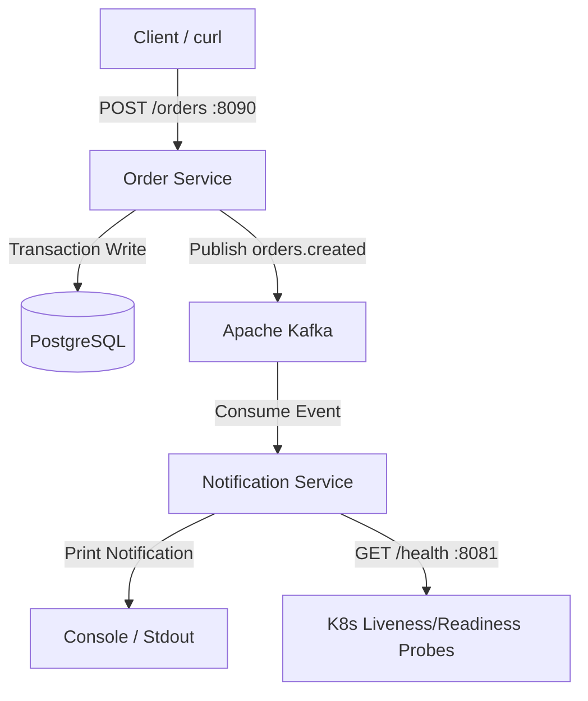

# Order Processing System

A production-grade, GitOps-driven monorepo replicating a modern enterprise DevOps, SRE, and Backend architecture.

---

## Overview
This system is an event-driven order processing engine designed to orchestrate order registration and downstream dispatch notifications. It was built to replicate a real-world company platform stack to demonstrate Go microservices, Apache Kafka event streaming, containerization, GitOps automation via FluxCD, local Kubernetes clusters via Kind, and enterprise Cloud Infrastructure on AWS using Terraform.

---

## Application Architecture



### Services Summary
* **Order Service (`services/order`)**: Exposes an HTTP API on port `8090` to receive new orders. Validates requests, calculates total prices, stores order records in PostgreSQL, and publishes an `orders.created` event to Kafka.
* **Notification Service (`services/notification`)**: An asynchronous consumer that subscribes to the Kafka `orders.created` topic and processes dispatch simulations, printing notification tasks to console. Exposes a separate HTTP health API on port `8081`.

---

## Infrastructure Architecture  

*(Diagram & detailed AWS architecture details will be completed during Phase 6)*

### Core Highlights
* **Networking**: Multi-AZ VPC design with public, private, and database-specific subnet layers.
* **Security**: Public traffic is restricted to the NGINX Ingress Controller. The database and Kafka broker clusters live strictly inside private subnets, only accessible to the microservices via security groups.

---

## Why I Made These Decisions

1. **Go Workspace (`go.work`)**: Set up a multi-module workspace at the root. This allows managing multiple independent microservices (each with its own `go.mod`) in a single repo without import issues, and makes IDE auto-import work seamlessly.
2. **Pure Go Kafka Client (`segmentio/kafka-go`)**: Avoided C-bound libraries (like `confluent-kafka-go` which requires CGO and a local GCC compiler). This keeps local compiling and Docker builds fast, portable, and free of system compiler dependencies.
3. **Distroless Docker Containers**: Packaged the Go binaries into `gcr.io/distroless/static-debian12` base images. These run without a shell, packages, or operating system utilities, minimizing the container footprint and eliminating common CVE vulnerabilities.
4. **Independent Health Ports**: The notification service exposes a dedicated HTTP port (`8081`) for health checks. This keeps health check traffic isolated from Kafka consumption and ensures Kubernetes can perform liveness and readiness checks.

---

## Local Development

Ensure you have **Go 1.26+** and **Docker** with Compose installed locally.

### Setup and Testing

To compile services and run tests from the root of the workspace:

#### 1. Compile Services
Builds binary executables for both services locally:
```bash
make build
```

#### 2. Run Unit Tests
Executes table-driven tests for all service modules:
```bash
make test
```

#### 3. View Test Coverage
Generates test coverage reports and saves visual HTML reports locally:
```bash
make test-cover
```

#### 4. Lint Codebase
Runs code formatting and security scans (requires `golangci-lint` installed):
```bash
make lint
```

---

### Running the App (Docker Compose)

The entire local stack (PostgreSQL, ZooKeeper, Kafka, and the services) is orchestrated via Compose.

#### 1. Boot up the environment
Starts the storage, messaging, and application containers:
```bash
make docker-up
```

#### 2. Verify containers are online
Check the health status of running services:
```bash
docker compose ps
```

#### 3. Send a test HTTP request
Create an order by sending a payload to the order service:
```bash
curl -i -X POST http://localhost:8090/orders \
  -H "Content-Type: application/json" \
  -d '{"customer_id": "cust-999", "items": [{"product_id": "prod-123", "quantity": 3, "price": 45.50}]}'
```

#### 4. Inspect Kafka Event Output
View log logs on the notification service to confirm event delivery:
```bash
docker compose logs -f notification-service
```

#### 5. Tear down the environment
Stops and deletes containers, volumes, and networks:
```bash
make docker-down
```

---

## Cloud Deployment

*(To be completed during Phases 3 & 6)*

* **Kind & EKS Provisioning**: Done via Terraform layers (`bootstrap` and `platform`).
* **GitOps Continuous Deployment**: Managed by FluxCD watching the `/flux` directory of this repository.

---

## Observability

*(To be completed during Phase 6)*

* Grafana / Prometheus metrics monitoring dashboards.
