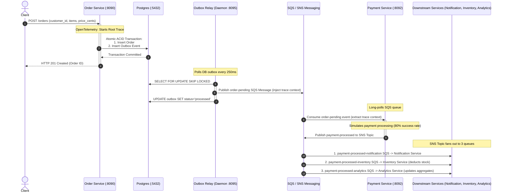

# Order Processing System — Application Architecture Walkthrough

This document outlines the step-by-step request lifecycle and event propagation path of a client order request flowing through the **Order Processing System** microservices.

---

## 1. Architectural Sequence Diagram

The diagram below illustrates the decoupled event choreography, transaction boundaries, and tracing path:



---

## 2. Step-by-Step Request Lifecycle

### Step 1: Client Submits Order (HTTP POST)
* **API Route**: `POST /orders` (served on port `8090` by `order-service`).
* **Input Payload**: The client sends a JSON request containing the customer ID and line items with quantities and prices defined in integer cents (e.g. `1250` for `$12.50`):
  ```json
  {
    "customer_id": "cust-demo",
    "items": [
      {"product_id": "item-abc", "quantity": 2, "price_cents": 1250}
    ]
  }
  ```
* **Telemetry**: An OpenTelemetry root span is automatically initialized by the net/http routing middleware.

### Step 2: Atomic Write to PostgreSQL (Transactional Outbox Pattern)
* **Database Action**: The `order-service` opens a database transaction (`BeginTx`) and performs three inserts:
  1. Inserts the order metadata into the `orders` table.
  2. Inserts the line items into the `order_items` table.
  3. Marshals the order into a JSON payload and inserts it into the `outbox` table with status `'pending'`.
* **Guarantee**: Both the business records and the outbox records are written atomically. If the database connection drops or a constraint fails, the transaction is rolled back. There is no risk of a "dual-write" failure where the database updates but the event is not queued.
* **HTTP Response**: The transaction commits, and `order-service` immediately returns an `HTTP 201 Created` status with the Order ID to the client.

### Step 3: Outbox Relay Queries Pending Events
* **Polling Action**: The `outbox-relay` background daemon polls the `outbox` table in PostgreSQL every 250 milliseconds.
* **Concurreny Locking**: The relay locks up to 10 pending events using a non-blocking select query:
  ```sql
  SELECT id, aggregate_id, payload
  FROM outbox
  WHERE status = 'pending'
  ORDER BY created_at ASC
  LIMIT 10
  FOR UPDATE SKIP LOCKED;
  ```
* **Guarantee**: The `FOR UPDATE SKIP LOCKED` clause ensures that multiple instances of the `outbox-relay` can scale horizontally. Each instance locks a distinct block of rows, preventing duplicate processing and race conditions.

### Step 4: SQS Publishing & State Commit
* **Queue Action**: For each retrieved outbox event, the `outbox-relay` publishes the JSON payload to the SQS `order-pending` queue using the AWS SDK client.
* **Trace Propagation**: The relay serializes the active OpenTelemetry `traceparent` details into the SQS Message Attributes.
* **Database Commit**: Once SQS confirms message delivery, the relay updates the status of the outbox record to `'processed'` in PostgreSQL and commits the transaction.

### Step 5: Payment Processing Simulation
* **Consumption Action**: The `payment-service` long-polls SQS queue `order-pending` for new events.
* **Trace Extraction**: It consumes the event, deserializes the trace context from the SQS message attributes, and starts a child span.
* **Payment logic**: It simulates card transaction processing (success rate of 80%, simulated failure rate of 20%).

### Step 6: SNS Event Broadcast
* **Publishing Action**: If payment succeeds, the `payment-service` publishes a `payment-processed` event to the AWS SNS topic.
* **Trace Propagation**: The OpenTelemetry traceparent context is again injected into the SNS Message Attributes.

### Step 7: Fanout to Downstream Queues
* **Infrastructure Routing**: AWS SNS automatically handles message replication and forwards the event to three separate SQS queues subscribed to the topic:
  1. `payment-processed-notification`
  2. `payment-processed-inventory`
  3. `payment-processed-analytics`
* **Guarantee**: Replicating events into separate queues guarantees that downstream workflows do not block one another. If the Notification Service goes offline, the Inventory Service continues to deduct stock, and the Analytics Service continues to process statistics.

### Step 8: Downstream Execution & Concurrency
The remaining services process the event simultaneously:
* **Notification Service**: Consumes from SQS `payment-processed-notification` and prints a customer confirmation receipt directly to standard output.
* **Inventory Service**: Consumes from SQS `payment-processed-inventory` and deducts the order's item quantities from the `inventory` table in PostgreSQL.
* **Analytics Service**: Consumes from SQS `payment-processed-analytics` and updates in-memory dashboard metric counters (total system revenue, payment success rates).
* **Telemetry**: All downstream consumers extract the trace context, linking all activities as child spans under the original client request for clear trace visualization in Jaeger.
