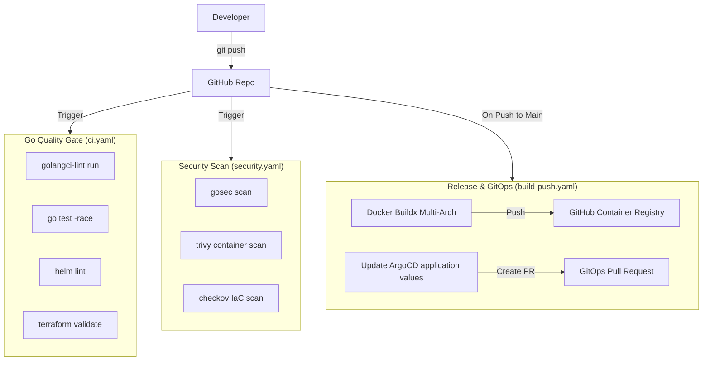

# Order Processing System — CI/CD Architecture Walkthrough

This document provides a detailed breakdown of the Continuous Integration (CI) and Continuous Delivery (CD) pipelines built using **GitHub Actions**.

---

## 1. CI/CD Architecture Diagram

The pipelines are divided into three specialized quality gates that protect the stability, security, and delivery of the codebase:

---

## 2. Gate 1: Go Quality Gate (`ci.yaml`)

* **Execution Trigger**: Runs on every Pull Request and every push to the `main` branch.
* **Purpose**: Verifies code health, formatting, syntax, and functionality before any merges.

### Quality Steps:
1. **Static Analysis & Linting**:
   * Runs `golangci-lint` utilizing settings from `.golangci.yml` across all 6 microservices declared in the Go workspace (`go.work`).
   * Checks for dead code, unhandled errors (e.g. unclosed database connections), styling bugs, and code complexity.
2. **Unit & Integration Testing**:
   * Runs all Go test packages with the `-race` detector enabled to trace concurrency issues, race conditions, and read/write collisions.
   * Generates a code coverage map (`coverage.out`).
3. **Helm Validation**:
   * Runs `helm lint` against the reusable `helm-charts/app-generic` chart to verify syntax structure, templates rendering, and required values.
4. **Terraform Validation**:
   * Initializes and validates all Terraform modules (`terraform/bootstrap` and `terraform/platform`) with `terraform validate` to prevent syntax errors prior to cloud execution.

---

## 3. Gate 2: Security Scan Gate (`security.yaml`)

* **Execution Trigger**: Runs on all Pull Requests and merges to `main`.
* **Purpose**: Identifies vulnerabilities in application code, dependencies, built container images, and infrastructure templates.

### Security Steps:
1. **Go Code Vulnerability Scan (SAST)**:
   * Uses `gosec` to scan the Go source files for security risks (such as insecure random number generators, hardcoded secrets, SQL injection vectors, or permissive file openings).
2. **Container Security Audit**:
   * Builds target container images and scans them with `trivy` to audit system packages, base images, and dependencies for CVEs (Common Vulnerabilities and Exposures).
3. **Infrastructure as Code (IaC) Scan**:
   * Audits the Terraform configurations using `checkov` to enforce cloud security baseline standards (e.g. validating KMS key policies, ensuring SQS queues are encrypted, and preventing open port security group definitions).

---

## 4. Gate 3: Build, Release & GitOps Gate (`build-push.yaml`)

* **Execution Trigger**: Runs strictly on a push or merge directly to the `main` branch.
* **Purpose**: Builds production-ready assets and automates GitOps environment updates.

### CD Steps:
1. **Docker Buildx Compilation**:
   * Builds container images for all microservices using Docker Buildx for multi-architecture support (`linux/amd64` and `linux/arm64`).
   * Base images are locked to minimal, secure static distroless configurations (`gcr.io/distroless/static-debian12`) to keep image sizes small and minimize vulnerability footprint.
2. **Asset Publishing**:
   * Logins to the **GitHub Container Registry (GHCR)** using repository secrets and publishes the built images tagged with the short Git SHA and `latest`.
3. **Automated GitOps Parameter Update**:
   * Uses `yq` to programmatically update the image tag overrides (substituting `latest` with the new short Git SHA tag) inside the ArgoCD base deployment configurations (`argocd/apps/base/*-values.yaml`).
4. **Pull Request Automation**:
   * Automatically commits the updated values files, pushes them to a release branch, and raises a new **Pull Request** back to `main`.
   * Once this PR is merged, **ArgoCD** instantly detects the configuration drift, pulls the new short Git SHA images from GHCR, and performs a zero-downtime rolling update on the EKS cluster.
