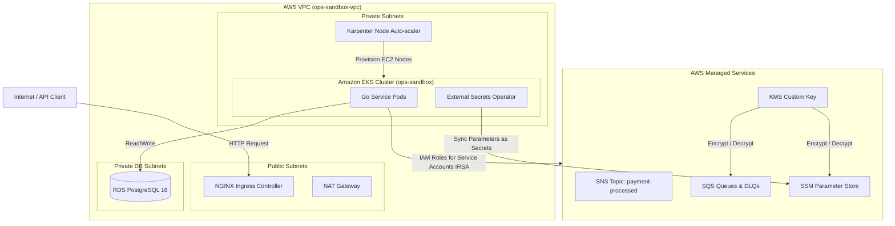

# Order Processing System — Infrastructure Architecture Walkthrough

This document outlines the cloud infrastructure topology, managed AWS services, network designs, and scaling controllers configured via **Terraform**.

---

## 1. Cloud Infrastructure Diagram

The infrastructure is provisioned strictly through two decoupled Terraform layers, maintaining separation of concerns between core cloud networks and cluster-level platform components:

---

## 2. Layer 1: Core Bootstrap Infrastructure (`terraform/bootstrap`)

This layer provisions the VPC networking and the baseline Kubernetes orchestrator:

* **VPC Networking Topology**:
  * Multi-Availability Zone (Multi-AZ) architecture distributed across 3 AZs.
  * **3 Public Subnets**: Hosts NAT Gateways and Ingress Application Load Balancers.
  * **3 Private Subnets**: Hosts EKS worker nodes, Karpenter-provisioned compute, and cluster operators, keeping them isolated from public internet ingress.
  * **3 Private Database Subnets**: Hosts the RDS PostgreSQL instance with security groups permitting entry only from private EKS subnets.
* **Amazon EKS Cluster control plane**:
  * Deploys EKS cluster control plane.
  * Configures an **OIDC Identity Provider (OpenID Connect)**. This enables Kubernetes ServiceAccounts to authenticate against AWS IAM roles via federation, eliminating the need to hardcode AWS secret keys inside the containers.

---

## 3. Layer 2: Platform Infrastructure (`terraform/platform`)

This layer provisions EKS operator configurations, databases, messaging queues, encryption keys, and autoscaling metrics:

### 1. Relational Database Cluster (AWS RDS)
* Deploys a managed Amazon RDS PostgreSQL 16 database.
* Access is locked within private DB subnets.
* Security rules require SSL communication (`sslmode=require`).
* The master connection credentials are dynamically generated and populated inside the AWS Systems Manager (SSM) Parameter Store.

### 2. Messaging & Pub/Sub (AWS SQS & SNS)
* Provisions the core queues (`order-pending` and downstream fanout queues).
* Creates Dead Letter Queues (DLQs) for every queue. Messages that fail processing 3 consecutive times are automatically redirected to the corresponding DLQ to prevent blocking the main queues.
* Provisions the `payment-processed` SNS Topic and maps the downstream SQS queues as fanout subscribers.

### 3. Compute Auto-scaling (Karpenter)
* Integrates **Karpenter** directly with EKS.
* Configures `EC2NodeClass` and `NodePool` templates defining machine types, subnets, and instance limits.
* Unlike traditional Auto Scaling Groups (ASGs), Karpenter queries unscheduled pod resource needs directly, provisions right-sized compute nodes within seconds, and terminates empty nodes dynamically to optimize resource cost.

### 4. Encryption & Security (AWS KMS)
* Deploys an AWS Customer Managed Key (CMK).
* Integrates KMS key policies directly with SQS and SSM Parameter Store to ensure all messages at rest and parameter strings are encrypted using custom cryptography.

### 5. Secrets Federation (External Secrets Operator - ESO)
* The External Secrets Operator running inside EKS assumes an IAM IRSA Role that permits reading and decrypting parameters in SSM Parameter Store.
* ESO syncs the SSM parameters into native Kubernetes Secrets inside EKS namespaces, which are then mounted into Go microservice pods as environment variables.
