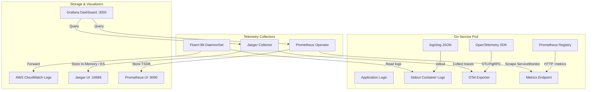

# Order Processing System — Observability Architecture Walkthrough

This document outlines the observability pipelines, metrics scrape rules, and distributed context propagation techniques used to monitor system health.

---

## 1. Observability Topology Diagram

Observability is built entirely on open-standard telemetry libraries embedded within the microservice runtimes, avoiding proprietary agent bindings:

---

## 2. Telemetry Pillars

### Pillar 1: Structured Logging (`log/slog`)
* **Core Library**: Native Go standard library `log/slog`.
* **Format**: All logs are serialized in **JSON format** and written directly to standard output (`stdout`).
* **Why**: Writing JSON logs to stdout removes execution bottlenecks from the application threads. In production, a **Fluent Bit** DaemonSet running on EKS nodes captures these container log outputs asynchronously and ships them to **AWS CloudWatch Logs** for indexing and retention.

### Pillar 2: Distributed Tracing (OpenTelemetry & Jaeger)
* **Core Library**: `go.opentelemetry.io/otel` (OpenTelemetry SDK).
* **Export Protocol**: Spans are exported over OTLP/gRPC to the Jaeger trace collector.
* **SQS Context Propagation**: 
  * Asynchronous queues interrupt standard HTTP trace contexts. To maintain a single trace lineage across multiple services separated by SQS queues, we implement a custom context propagation carrier.
  * During message publishing, the `outbox-relay` writes the current trace context token (`traceparent`) into SQS Message Attributes.
  * Downstream consumers (like `payment-service` and `inventory-service`) read the SQS message attributes, deserialize the `traceparent` key, and inject it back into the Go execution context as a child span.
* **Visualization**: Tracing spans are queried and analyzed inside the **Jaeger UI** dashboard on port `16686`.

### Pillar 3: Prometheus Metrics
* **Core Library**: Prometheus Go client `github.com/prometheus/client_golang/prometheus`.
* **Export Route**: Every service spins up a `/metrics` HTTP route to expose stats in the standard Prometheus text exposition format.
* **Scraping**: In Kubernetes, the **Prometheus Operator** identifies EKS pod metrics endpoints dynamically via `ServiceMonitor` definitions.
* **Visualization**: **Grafana** connects to Prometheus to graph request rates, SQS queue consumer counts, database connections, CPU/Memory resource constraints, and API response latencies.
